asasa
# Protetor anti-curto com relé
Protetor com desarme por relé para proteção de circuitos eletrônicos.

Características:
- O relé e resistores podem ser dimensionados para outras tensões
- Ao manter o curto o circuito não rearma
- Conectores para LEDs e botão externos (para montagem em cases)
- Tecnologia PTH e placa de uma face para ser possível montar com ferramentas básicas

Projetos esquemáticos e de layout de placas desenvolvidos em Eagle 9.2.0 e Fusion 360.
Bibliotecas personalizadas de produtos genéricos/equivalentes fornecidas no repositório.

###### Bibliotecas personalizadas
* [Conectores KRE](https://github.com/leonardokr/eagle-bibliotecas-3d) - Conectores utilizados na placa para facilitar montagem e manutenção

## Resumo

Esquema do circuito e da placa feitos no Eagle, é em placa simples e componentes PTH. As dimensões são pequenas e os conectores de entrada e saída são para fácil conexão e troca, mas podem ser soldados fios diretamente na furação.

  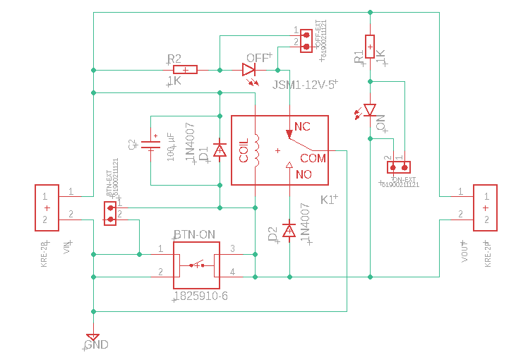
  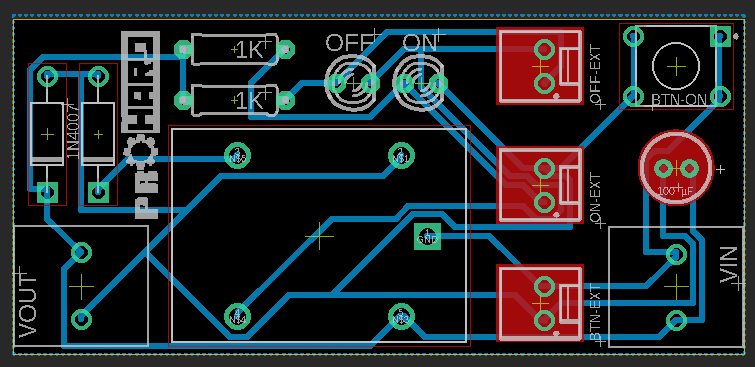

 

Imagem da placa gerada, assim como o esquema de furação (os arquivos PDF com tamanho real estão no projeto):

  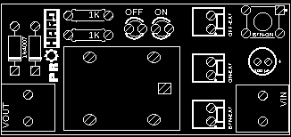
  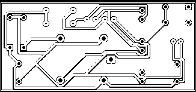
  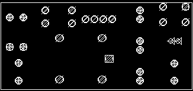

  Download dos arquivos, sendo: Cima; Cima (espelhado); Fundo; Fundo (espelhado); Furação; Furação (espelhado).

  
  
  
  
  
  

 

###### Imagens 3D do projeto da placa:

  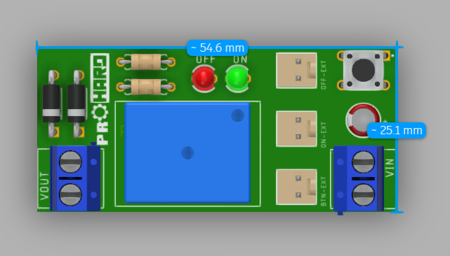
  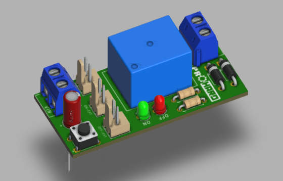
  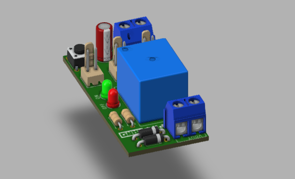
  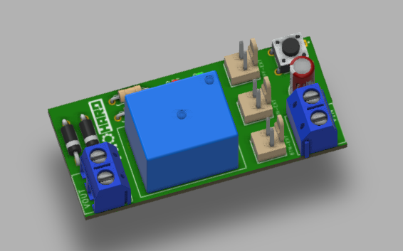
  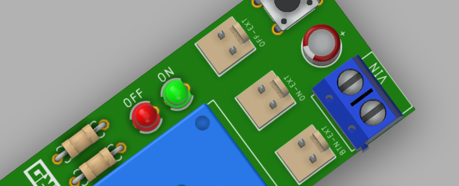
  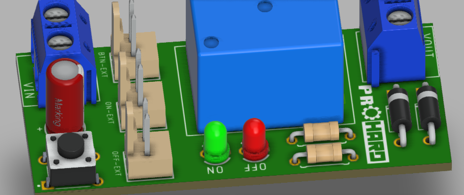
  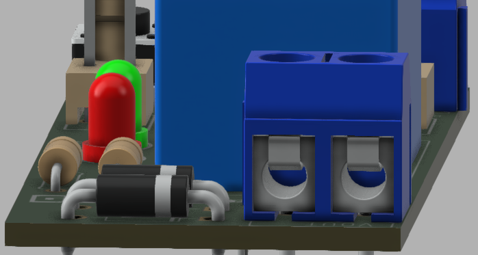
  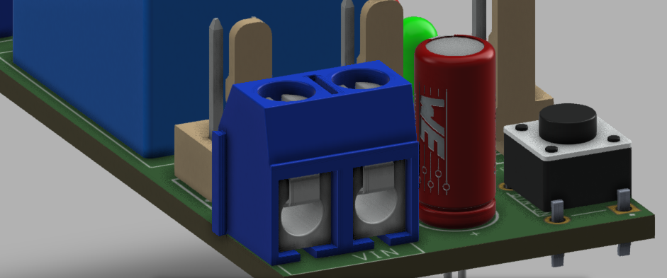

###### Arquivos 3D
 

  Download dos arquivos, sendo: F3D; SKP; OBJ; DWG.

  
  
  
  

